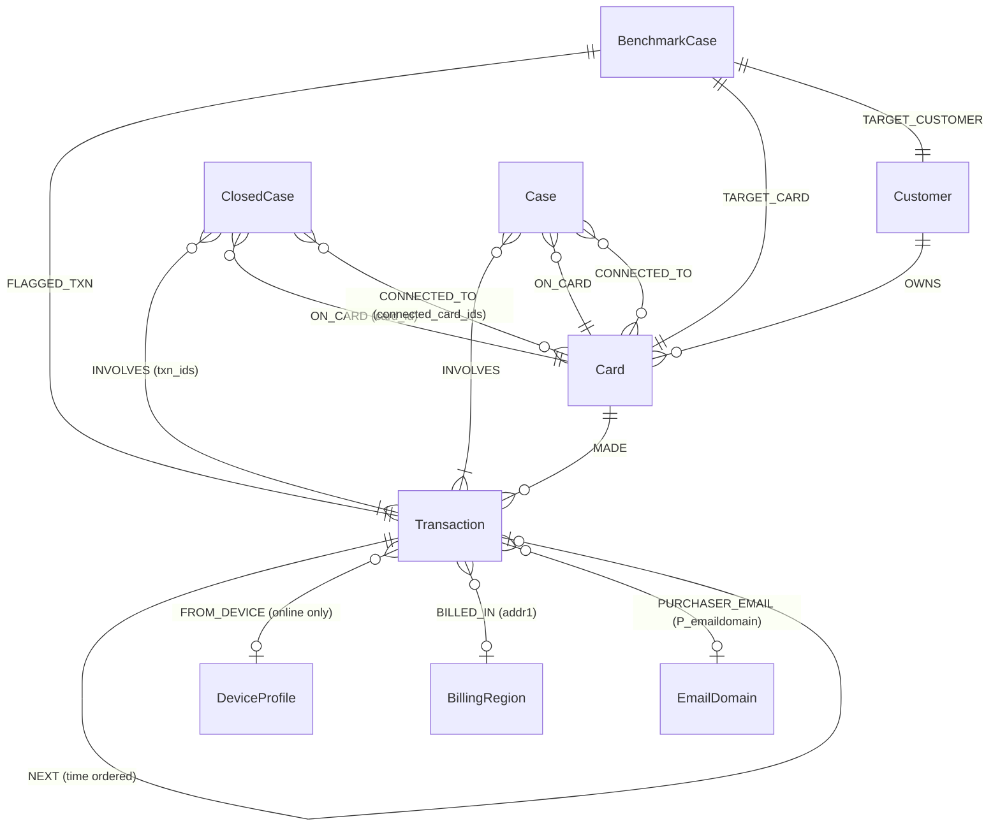

# HHGOA Dataset Profile & Architectural Discovery

**Date**: 2026-09-20  
**Project**: HHGOA / TigerGraph Agentic Fraud Investigation Hackathon  
**Phase**: Phase 0 — Data Discovery  
**Status**: Completed & Verified  

---

## 1. Executive Summary & Authoritative Sources

The HHGOA dataset is derived from six months of card transactions from the **IEEE-CIS Fraud Detection** dataset published by Vesta Corporation. All original rows and columns are preserved, with four specific augmentations by TigerGraph:
1. `customer_id`: Synthesized customer grouping derived from card issuer codes.
2. `ts`: Real timestamp formatted as `YYYY-MM-DD HH:MM:SS` ranging from July 2 to December 31, 2016.
3. `channel`: Transaction channel (`in_person` or `online`).
4. `risk_score`: Continuous real-time detection model score ($0.0 \le \text{risk\_score} \le 1.0$), provided as an **input feature**, never an authoritative verdict.

The repository data files are located in `data/raw/` and are strictly **immutable**.

---

## 2. File Inventory, Row Counts & Schema Inspection

All counts were verified via streaming/chunked processing without loading the full transaction dataset into memory.

| File Name | Size (Bytes) | Exact Header Columns | Exact Row Count | Description |
|---|---|---|---|---|
| `data/raw/transactions.csv` | 707,936,515 | 397 | 590,742 | All original 393 Vesta columns + `customer_id`, `ts`, `channel`, `risk_score`. Disguised amounts/IDs/timestamps. |
| `data/raw/identity.csv` | 26,716,154 | 41 | 144,432 | Vesta identity records for online transactions only. Joins on `TransactionID`. |
| `data/raw/closed_cases_history.csv` | 2,706,417 | 15 | 5,565 | Bank's finished historical investigations (July–October 2016). 4,665 `confirmed_fraud`, 900 `cleared`. |
| `data/raw/case_pack.csv` | 3,548 | 8 | 20 | The 20 benchmark exam alerts (November–December 2016) to be investigated. |
| `data/raw/README.md` | 38,663 | N/A | 473 lines | Authoritative task specification, policy rules R1–R10, schema, and answer format. |

---

## 3. Detailed Column Groups & Identifier Mappings

### 3.1 Identifier Columns
- **`TransactionID`** (`transactions.csv`, `identity.csv`): Integer primary key for transactions, 1-to-1 join to `identity.csv` for online transactions.
- **`customer_id`** (`transactions.csv`, `closed_cases_history.csv`, `case_pack.csv`): String customer identifier (e.g., `C08623`, `C12382`).
- **`card_id`** (Derived in `transactions.csv`, explicit in `closed_cases_history.csv` & `case_pack.csv`): String card identifier (e.g., `C08623-K1`, `C08623-K2`).
- **`case_id`** (`closed_cases_history.csv`, `case_pack.csv`): Unique investigation identifier (`CC-0001` through `CC-5565` for historical cases; `HHG-001` through `HHG-020` for benchmark cases).
- **`DeviceProfile`** / `device_id` (`identity.csv`): Combination of `DeviceInfo` + `id_30` (OS) + `id_31` (browser) + `id_33` (screen resolution).
- **`addr1`** (`transactions.csv`): Anonymized numerical billing region code (e.g., `444.0`, `264.0`).
- **`P_emaildomain` / `R_emaildomain`** (`transactions.csv`): Purchaser and recipient email domain strings (e.g., `gmail.com`).

### 3.2 Column Groups from Vesta & Augmentations
- **Core Transaction (3)**: `TransactionID`, `TransactionDT` (seconds offset), `TransactionAmt` (USD).
- **Product & Channel (2)**: `ProductCD` (`W`, `C`, `H`, `R`, `S`), `channel` (`in_person` vs `online`). `ProductCD == 'W'` designates in-person transactions.
- **Card Attributes (6)**: `card1` to `card6` (issuer codes, card network `card4`, card type `card6`, card family `card2`).
- **Geography (4)**: `addr1` (billing region), `addr2` (billing country, 87 = home country), `dist1`, `dist2` (distances).
- **Email Domains (2)**: `P_emaildomain`, `R_emaildomain`.
- **Engineered Count Features (14)**: `C1` to `C14`.
- **Engineered Time Delta Features (15)**: `D1` to `D15` (days since prior events/transactions).
- **Match Flags (9)**: `M1` to `M9` (e.g., name/address match booleans).
- **Vesta V-Features (339)**: `V1` to `V339` (ranking, velocity, and entity relationship features).
- **Identity Features (41)**:
  - Categorical & System: `id_12` to `id_38` (`id_15` = New/Found, `id_23` = proxy type, `id_30` = OS, `id_31` = browser, `id_33` = screen).
  - Encoded Ratings: `id_01` to `id_11`.
  - Device Info: `DeviceType` (`desktop`, `mobile`), `DeviceInfo` (hardware model string).
- **Model / Operational Additions (2)**: `ts` (ISO datetime), `risk_score` (float 0–1).

---

## 4. Critical Card ID Derivation Rule

### The Rule
`transactions.csv` has no explicit `card_id` column.
- Within each `customer_id`, distinct values of `card2` correspond to distinct cards.
- **Sorting Rule**: `NaN` `card2` sorts first, followed by numeric values in ascending order.
- Indexing starts at 1: `K1`, `K2`, `K3`...
- Formal mapping:
  - If a customer has `card2` values `[NaN, 470.0]`, then:
    - `NaN` $\rightarrow$ `K1` (e.g., `C08623-K1`)
    - `470.0` $\rightarrow$ `K2` (e.g., `C08623-K2`)

### Verification
- Customer `C08623` has 1,140 total transactions in `transactions.csv`:
  - 6 transactions with `card2 = NaN` $\rightarrow$ `C08623-K1`
  - 1,134 transactions with `card2 = 470.0` $\rightarrow$ `C08623-K2`
- Transaction `3530164` has `customer_id = 'C08623'` and `card2 = 470.0`, therefore belongs to **`C08623-K2`**.
- This matches `case_pack.csv` row for `HHG-003`:
  `HHG-003, 2016-12-10 15:01:21, customer_report, ..., 3530164, C08623-K2, C08623`
- Automated test in `tests/test_card_id_derivation.py` verifies this exact logic and passes 100%.

---

## 5. Entity Relationship Mapping



1. **Customer $\rightarrow$ Card**: 1-to-many relationship (`Customer.customer_id` $\rightarrow$ `Card.card_id`).
2. **Card $\rightarrow$ Transaction**: 1-to-many relationship (`Card.card_id` $\rightarrow$ `Transaction.TransactionID`).
3. **Transaction $\rightarrow$ Transaction (`NEXT`)**: Sequential chain ordered chronologically by `ts` within a card.
4. **Transaction $\rightarrow$ DeviceProfile**: Many-to-1 for online transactions (`identity.csv` joined on `TransactionID`).
5. **Transaction $\rightarrow$ BillingRegion**: Many-to-1 (`addr1`).
6. **Transaction $\rightarrow$ EmailDomain**: Many-to-1 (`P_emaildomain`).
7. **ClosedCase $\rightarrow$ Card / Transaction**: Historical investigations linking to primary card, connected cards, and involved transactions.
8. **BenchmarkCase (`case_pack.csv`) $\rightarrow$ Entities**: Refers to a specific `flagged_txn_id`, `card_id`, and `customer_id`.

---

## 6. Missing-Value Behavior & Online-Only Fields

1. **In-Person vs. Online (`channel`)**:
   - In-person transactions are defined by `ProductCD == 'W'`.
   - In-person transactions **never** have records in `identity.csv` (no device info, no IP ratings, no browser details).
   - **Crucial Rule**: Missing identity records for in-person transactions is normal, expected behavior, and **must not be treated as a fraud signal**.
2. **`card2` Nulls**:
   - `card2` is null for a subset of cards. Handled strictly by sorting NaNs first to assign `K1`.
3. **`first_fraud_txn_id` in `closed_cases_history.csv`**:
   - Exactly 900 rows have null `first_fraud_txn_id`.
   - These 900 rows correspond 1:1 to all `cleared` cases (`outcome == 'cleared'`).
   - Cleared cases must never be discarded; they represent verified false alarms and legitimate historical baselines.
4. **`connected_card_ids` in `closed_cases_history.csv`**:
   - Null for 5,561 rows; non-null for 4 cases indicating cross-card fraud rings.
5. **`risk_score` in `case_pack.csv`**:
   - Null for 9 cases where the trigger is `customer_report` or `analyst_request`. Only populated for `risk_score` triggers.
6. **`addr1` (Billing Region)**:
   - Contains missing values where regional billing was not provided.

---

## 7. Benchmark Case Pack Structure (`case_pack.csv`)

20 benchmark cases from November and December 2016:
- **Triggers**:
  - `risk_score`: 11 cases (HHG-001, 002, 005, 007, 010, 012, 013, 015, 017, 019, 020)
  - `customer_report`: 8 cases (HHG-003, 004, 006, 008, 009, 011, 016, 018)
  - `analyst_request`: 1 case (HHG-014 — multi-card device investigation)
- **Chronology**: Spans 2016-11-12 to 2016-12-29. Cases must be evaluated in chronological order to prevent future-case information leakage.

---

## 8. Fraud Patterns, Policy Rules & Approval Routes

### 8.1 The Five Known Patterns + Undocumented
1. **`card_testing`**: Small online authorizations ($\ge 3$, typically $<\$5$) followed by a larger purchase. Policy R5.
2. **`card_not_present_fraud`**: Unusual online transactions (amount/product mismatch) without physical card. Often 2–4 within 48 hours. Policy R1–R4.
3. **`card_not_present_new_device`**: Online CNP transaction from a device marked `New` (`id_15 == 'New'`) or behind anonymous proxy (`id_23`).
4. **`out_of_region_use`**: In-person transactions in a new billing region while normal activity continues at home (parallel activity = clone; no parallel activity = travel). Policy R2, R3.
5. **`account_takeover`**: Inconsistent mixed-channel activity, credential/match-flag anomalies (`M` flags mismatch).
6. **`undocumented`**: Coordinated/repeated abuse across customers not fitting known patterns (requires detailed `pattern_description`).
7. **`none`**: Legitimate activity / false alarms.

### 8.2 Fraud Policy Rules (R1–R10)
- **R1 (Weak Signal / Single Signal)**: Fraud probability 0.40–0.75 and only 1 signal $\rightarrow$ `VERIFY_WITH_CUSTOMER` (auto) or `STEP_UP_AUTH` (auto) before blocking. If exposure $> \$500$, also `ESCALATE_TO_ANALYST` (auto).
- **R2 (Customer Denied)**: `BLOCK_CARD` (L1 if $\le \$2,500$, L2 if $> \$2,500$) + `CREATE_CASE` (auto). If exposure $> \$1,000$ or connected to prior fraud ring: `FILE_REPORT` (L2).
- **R3 (Customer Confirmed)**: `CLOSE_NO_FRAUD` (auto).
- **R4 (No Reply 24h)**: `MONITOR_CARD` (auto) + `DECLINE_TRANSACTION` on pending (L1). If exposure $> \$500$: `ESCALATE_TO_ANALYST` (auto).
- **R5 (Card Testing)**: `DECLINE_TRANSACTION` (L1) + `STEP_UP_AUTH` (auto). If purchase cleared: `BLOCK_CARD` (L1/L2 by exposure).
- **R6 (Shared Origin / Device Ring)**: Shared device on $\ge 3$ cards $\rightarrow$ `CREATE_CASE` (auto) + `FILE_REPORT` (L2) + `MONITOR_CONNECTED_CARDS` (auto). Ring exposure threshold $> \$1,000$ for SAR.
- **R7 (Disputed Recurring / Subscription)**: Disputed charge matching recurring pattern $\rightarrow$ `CREATE_CASE` (auto) + `VERIFY_WITH_CUSTOMER` (auto) + `WARN_CUSTOMER` (auto). **Never block!** On confirmation: `CLOSE_NO_FRAUD` (auto).
- **R8 (Uncertain & Exposed)**: Verdict `uncertain` and exposure $> \$500$ $\rightarrow$ `ESCALATE_TO_ANALYST` (auto). Do not block without confirmation.
- **R9 (Undocumented Pattern)**: `CREATE_CASE` (auto) + `FILE_REPORT` (L2) + `ESCALATE_TO_ANALYST` (auto).
- **R10 (Block All Cards)**: `BLOCK_ALL_CARDS` (always L2) **only** if $\ge 2$ confirmed fraud cards for same customer.

### 8.3 Approval Routes
- **`auto`**: `ALLOW_TRANSACTION`, `MONITOR_CARD`, `MONITOR_CONNECTED_CARDS`, `WARN_CUSTOMER`, `VERIFY_WITH_CUSTOMER`, `STEP_UP_AUTH`, `GENERATE_REPORT`, `CREATE_CASE`, `ESCALATE_TO_ANALYST`, `CLOSE_NO_FRAUD`.
- **`L1`**: `DECLINE_TRANSACTION`, `BLOCK_CARD` (when exposure $\le \$2,500$).
- **`L2`**: `BLOCK_CARD` (when exposure $> \$2,500$), `BLOCK_ALL_CARDS` (always), `FILE_REPORT` (always).

---

## 9. Required Answer JSON Structure & Fields

Every benchmark case must produce `<case_id>.json` in `cases/generated/` with the following schema:

```json
{
  "case_id": "HHG-XXX",
  "case": {
    "status": "open|closed_fraud|closed_legitimate|escalated",
    "verdict": "fraud|legitimate|uncertain",
    "fraud_probability": 0.0,
    "pattern": "card_testing|card_not_present_fraud|card_not_present_new_device|out_of_region_use|account_takeover|undocumented|none",
    "pattern_description": "",
    "affected_txn_ids": [],
    "first_suspicious_txn_id": "",
    "connected_card_ids": [],
    "connected_device_profiles": [],
    "exposure_usd": 0.0,
    "evidence": [
      {
        "claim": "string",
        "source": "graph|document|customer|external",
        "ref": "string",
        "entity_ids": []
      }
    ],
    "similar_prior_cases": [],
    "summary": "string",
    "written_to_graph": true,
    "graph_case_id": "string"
  },
  "evidence_requests": [
    {
      "type": "customer_validation|step_up_auth|analyst_info",
      "asked_after_step": 1,
      "simulated": true,
      "assumed_response": "string",
      "response": "string"
    }
  ],
  "next_best_actions": {
    "initial": [
      {"action": "ACTION_NAME", "route": "auto|L1|L2", "reason": "string"}
    ],
    "final": [
      {"action": "ACTION_NAME", "route": "auto|L1|L2", "reason": "string"}
    ],
    "what_changed": "string"
  },
  "sar": {
    "file": false,
    "reason": "string",
    "narrative": "string",
    "subjects": [],
    "total_amount_usd": 0.0,
    "activity_dates": []
  },
  "stop_reason": "string",
  "tool_calls": 0,
  "tokens": 0,
  "latency_s": 0.0
}
```

---

## 10. Phase 0 Verification Checklist

- [x] Read `README.md` completely.
- [x] Inspected every CSV header (`transactions.csv`, `identity.csv`, `closed_cases_history.csv`, `case_pack.csv`).
- [x] Counted rows using chunked/streaming without loading 708MB into memory.
- [x] Identified all identifier columns (`TransactionID`, `customer_id`, `card_id`, `case_id`, `device_id`, `addr1`, `email_domain`).
- [x] Mapped entity relationships across customers, cards, transactions, devices, regions, closed cases, and benchmark cases.
- [x] Verified missing-value behavior (`card2` NaNs, `ProductCD == 'W'` in-person missing identity, `first_fraud_txn_id` nulls on cleared cases).
- [x] Identified online-only fields (`identity.csv`, `DeviceInfo`, `id_01`-`id_38`).
- [x] Documented benchmark case pack structure and triggers.
- [x] Documented required answer JSON structure and fields.
- [x] Documented all fraud patterns and policy rules (R1–R10) with exact approval routes.
- [x] Verified Card ID derivation rule: `C08623-K2` owns transaction `3530164` (verified via `tests/test_card_id_derivation.py`).
